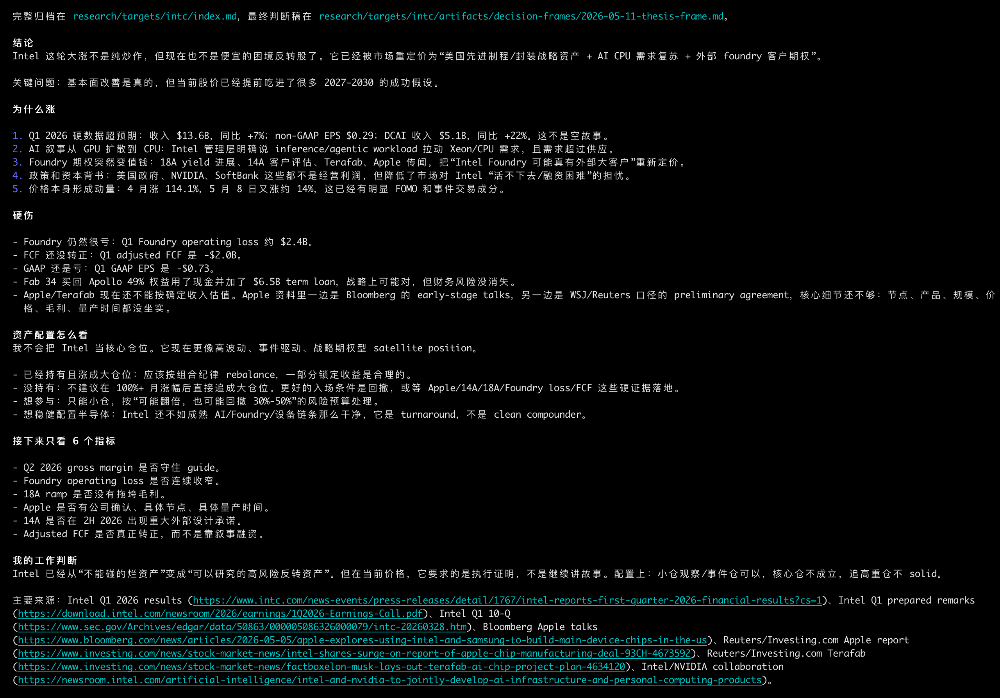

# AIFi

[](./README.md)
[](./README.zh-CN.md)

AIFi 是一个 agent-first 的投资研究工作区。它用一组可复用的 AI skills
收集公告、财报、新闻、市场信号、竞品和风险证据，并把研究材料沉淀到
`research/`，方便后续持续复用。

它用于研究和决策辅助，不做自动交易，也不是财务建议。

## 用法

```sh
codex "分析 Intel 最近为什么大涨，以及应该如何看待它在组合里的位置"
```

```sh
codex "更新我的 Intel 研究，补充最新财报、公告、新闻和市场信号"
```

```sh
codex "对比 Intel、AMD、Nvidia 和 TSMC，并总结 bull/base/bear case"
```

## 效果预览


