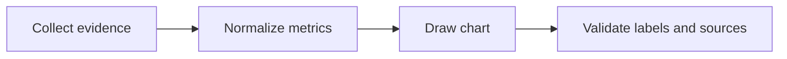
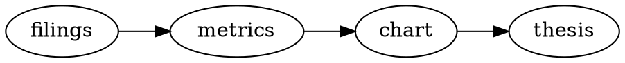

# Text-First Diagrams

Use text-first diagram specs when the environment can display markdown diagrams
or when the artifact should remain reviewable in version control.

## Mermaid

Use Mermaid for flowcharts, sequence diagrams, timelines, class diagrams, and
simple state diagrams.



## Graphviz DOT

Use Graphviz for dense dependency graphs, DAGs, and layouts where rank control
matters.



## Vega-Lite JSON

Use Vega-Lite when the agent should produce a portable declarative chart spec
instead of renderer-specific code.

```json
{
  "$schema": "https://vega.github.io/schema/vega-lite/v5.json",
  "mark": "bar",
  "encoding": {
    "x": {"field": "category", "type": "nominal"},
    "y": {"field": "value", "type": "quantitative"}
  }
}
```

## Selection Rules

- Mermaid: process explanation and lightweight docs.
- Graphviz: graph topology with many edges.
- Vega-Lite: reusable chart spec, especially for data apps.
- Markdown tables: exact values matter more than visual shape.
